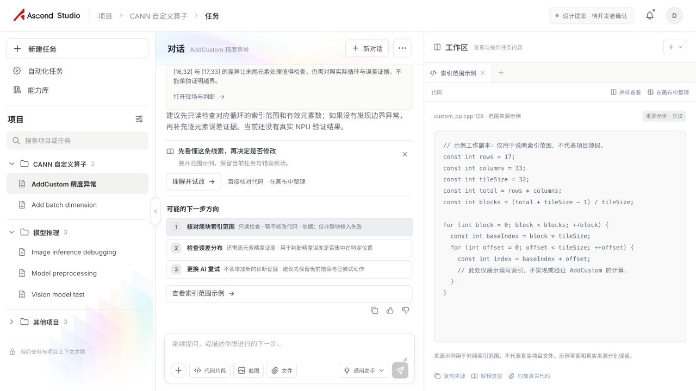
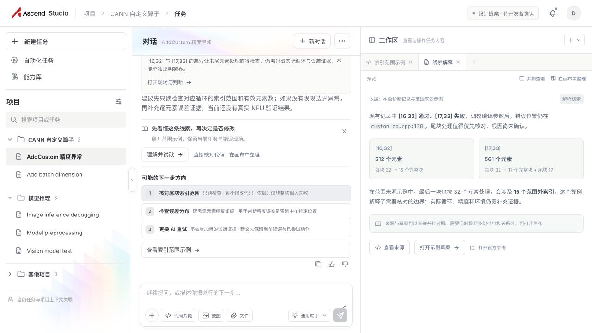
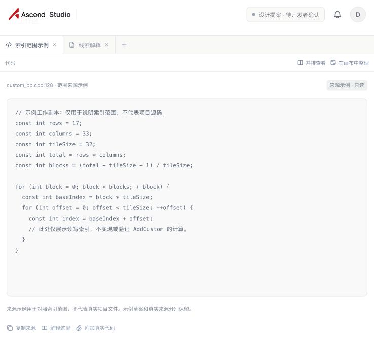
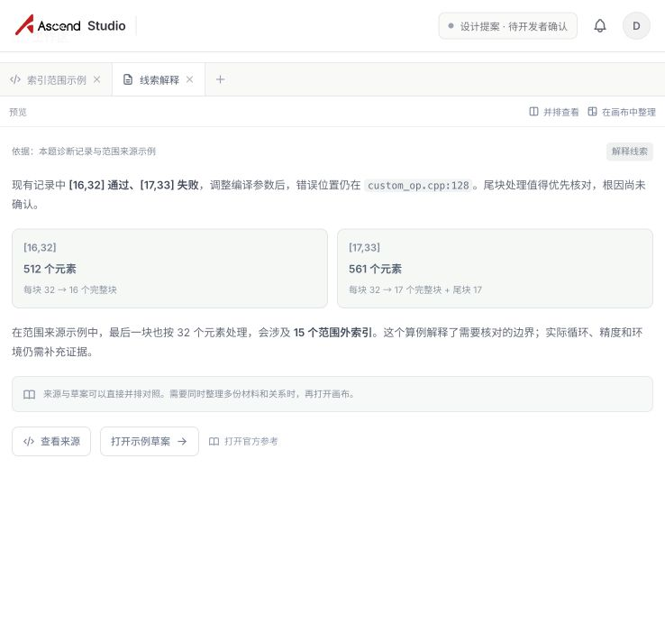

# 问题02「判断与纠错」原型视觉 QA

## 对照材料

- Source visual truth: `/Users/hsin/.codex/generated_images/01a0f0fa-7e78-7c81-a14c-994e31ca9b7b/exec-762b9846-774f-4eb4-a3ab-84ecbdd968c9.png`
- Source dimensions: 1584 × 993 px.
- Implementation: Codex In-app Browser, `http://127.0.0.1:5173/`.
- Implementation capture: Codex In-app Browser capture shown during this review; 1584 × 994 px screenshot at a 1584 × 994 CSS viewport. The current CUA browser API does not expose a persistent screenshot file path.
- Density normalization: screenshot dimensions match the CSS viewport 1:1; no resampling. Source is one pixel shorter in height, so that edge difference was excluded.
- State: default AddCustom 精度异常 task; rationale expanded; first next-step route selected; no extra chat messages.
- Additional viewport check: 1280 × 720. The message and diagnostic regions scroll independently while the composer remains visible.

## Full-view comparison

The three-column structure matches the selected mock: compact grouped project tasks on the left, the task conversation in the middle, and evidence, uncertainty, and action suggestions on the right. The conversation remains visible and contains a detailed explanation plus selectable next steps. The right panel preserves the unconfirmed status of the tail-block clue. The automation and capability-library shortcuts remain in the sidebar.

## Focused-region comparison

- Left navigation and task groups: shortcut order, project grouping, compact row spacing, and neutral selected state reviewed.
- Conversation: message indentation, readable response width, attempt context, rationale expansion, and next-step selection reviewed.
- Judgment panel: evidence rows, pale yellow uncertainty card, no text outline or glow, and synchronized action state reviewed.
- Decorative image: restrained pastel accent remains confined to the top of the right panel.

## Fidelity surfaces

- Typography: compact UI sizes follow the user's request to reduce overall type size. Key labels remain readable at the 1584 × 994 view; secondary metadata uses smaller type. The body response uses slightly more line spacing and denser evidence copy than the first implementation.
- Spacing and layout: left navigation uses 22vw at the desktop comparison width; conversation and operation regions stay close to the agreed 55:45 ratio. Message inset and card widths were adjusted to match the mock's alignment. At 1280 × 720, long content scrolls within its panel instead of hiding the composer.
- Colors and tokens: warm white and light gray dominate; cool blue-violet is used sparingly. Selected task/action states are neutral gray without a saturated outline or left stripe. The uncertainty card uses a pale yellow surface; its heading has no stroke or shadow.
- Images and assets: Ascend logo and the supplied generated glass accent are image assets; no decorative art is drawn with CSS.
- Copy and content: `[16,32]` passes, `[17,33]` fails, and `precision mismatch` at `custom_op.cpp:128` are presented as the known evidence. Tail-block handling is a lead to investigate, not a confirmed cause. The UI does not claim real NPU validation.

## Comparison history

1. Initial browser render was blank because `IconLock` was used without being imported. Added the missing import; the page then rendered and the production build passed.
2. First visual pass had a sparse, left-shifted conversation and short right-side cards. Added the diagnostic explanation and next-step rows to the conversation, aligned the message inset to the mock, and increased evidence/action row height while keeping compact typography.
3. Rechecked the 1584 × 994 main view and 1280 × 720 desktop view. No remaining P0/P1/P2 visual or functional mismatch was found.

## Interaction and build checks

- Project search filters grouped tasks and supports project-name matches.
- Rationale expands and collapses.
- Selecting an action in either the conversation or right panel updates the selected route and primary action label.
- Sending a chat message appends the user message and assistant response; the original review state was restored afterward.
- `npm run build` passed and produced the Vite client and Sites build artifacts.

## Findings

- No actionable P0/P1/P2 findings remain.

## Follow-up polish

- The generated mock uses slightly larger body text in places. The implementation keeps the requested smaller, denser type scale; adjust after the user's review if they want more visual weight.

## 2026-09-30 · 对话消息样式澄清

- 用户澄清：AI 回复应直接铺在对话区背景上，不放在气泡里；仅用户消息使用靠右气泡。
- 移除 AI 回复的底色、边界、阴影与气泡尾，恢复纯背景文本；用户气泡保持右对齐。三栏结构与文案不变。
- 在 1280 × 720 预览中确认 AI 回答直接显示在白色对话背景上，用户消息仍是靠右浅灰气泡；三栏结构保持完整。长回答继续在对话区滚动，输入区固定。
- `npm run build` 通过。此题仍处于单题评审阶段，用户确认后再开始下一题。

## 2026-10-03 · 移除对话头像

- 用户提出对话区不要头像；已移除用户与 Ascend Studio 的头像，保留各自的文字标识。
- AI 回复继续直接显示在背景上，用户气泡靠右；调整消息容器列数后复核三栏结构没有变化。
- `npm run build` 通过。窄视口预览确认双方头像已移除、AI 文本无气泡底、用户气泡靠右；该视口按既有响应式规则纵向堆叠三栏，未在本轮重新做桌面尺寸截图。

final result: passed

## 2026-10-09 · 交互补齐

- 将仅弹出提示的入口改为实际表单、菜单和操作区，覆盖项目任务切换与创建、能力选择、代码附件、发送、AI配置、对话历史、自动化状态与演示运行、证据详情和复核记录。保留既有三栏结构及对话视觉规范。
- 在 In-app Browser 的 1584 × 994 桌面视口查看初始界面与操作状态。实际走过代码范围计算 → 误差示例 → 复核生成 → 返回诊断；记录出现在当前任务的对话与右侧列表。范围算例为 561 / 32；示例 CSV 为 8 个元素、3 个超差，界面保留演示标识。
- 查看任务切换、新建任务、能力加入、代码片段关联、发送、新对话与历史恢复、自动化开关与演示运行，以及更换诊断助手并保留现有证据的状态。新对话会取消尚未完成的旧演示答复；任务间上下文分开保留。
- 更新后浏览器没有捕获到 console error。`npm run build` 通过，生成既有 Vite/Sites 构建产物；未新增或运行自动化测试。
- 演示回复、自动化状态不连接真实 AI、调度器或硬件；用户 CSV 的误差计算在浏览器内执行，不代表完整算子精度验证。附件与任务状态保存在本次页面会话中，刷新恢复默认状态。
- 本轮未应用尚未选定的 ImageGen 装饰方案。交付前刷新原型，恢复默认 AddCustom 任务，供用户评审。

## 2026-10-09 · 来源方案交互迁移

### 范围与来源

- 更新目标：当前问题02，保留Ascend Studio三栏壳。交互取自 `/Users/hsin/Documents/Coding/AscendCANN/cann-dashboard/ploy-interaction-lab/learning-canvas-story/index.html#19`、`story-data.mjs`及`build.mjs`中的B1–B6与共用机制。来源画布的整体布局与图像预处理技术结论不作为本原型的视觉或技术事实。
- 本轮视觉基准：`evidence/20261009-before-flow.jpg`，即实施前现有原型（继承无头像、AI文本铺背景、用户气泡靠右及中性选中等已确认修改）。1584×994像素与CSS视口，dpr=1。
- 默认状态更新图：`evidence/20261009-default-final.jpg`；解释状态最终图：`evidence/20261009-understand-final.jpg`；两者同为1584×994，密度1:1，不重采样。基准与默认态合并于 `evidence/20261009-shell-comparison.jpg`（3168×1024，顶部30px为比较标签）。
- 同状态字号迭代：`evidence/20261009-understand.jpg` 对照最终解释图，合并全图 `evidence/20261009-typography-comparison.jpg`；右侧1028–1584的局部1:1比较为 `evidence/20261009-operation-typography-focus.jpg`。本轮实际打开合并比较和局部比较后形成结论。
- 其他状态：`evidence/20261009-diff.jpg`、`20261009-validation.jpg`、`20261009-contents-final.jpg`。

### 五项视觉检查

- 字体：沿用系统中文字体与原有层级；操作区正文12px、代码/Diff11px，元信息至少10px，避免初版8–9px文本过小。新标题16px，与既有右栏一致。
- 布局：默认态比较确认左侧项目分组、快捷入口及三栏边界未变，中央/右侧约55:45。新增就地入口使下方内容继续在原面板滚动；输入框保持可见。只在右侧展开材料，没有添加学习中心或新页面。
- 色彩：暖白、浅灰、中性选中保持；冷蓝紫用于克制的提示和操作，Diff行采用浅淡增删底色。正文对比度加深，没有彩色左条、文字描边或新高饱和选中态。
- 图片：Ascend标识与现有玻璃装饰资产保持；本轮未使用尚未选定的新ImageGen装饰图。操作界面由可编辑组件组成。
- 内容：已知现场及根因未知表述保留；所有演算明确是示例，应用只在浏览器副本中发生；范围通过不代表精度、项目修复或NPU通过。旧尝试保存快照与来源，手改代码不冒充执行。

### 修正与再次观察

1. 初版操作区8–9px与过浅文字，属于P2。提高正文/代码/元信息字号并加深文字；最终同状态全图和局部比较显示正文层级清晰，颜色与原壳一致。内容索引同样提高字号，重新捕获最终图。
2. 无变化提案原可点击应用，属于P2状态问题。增加无改动说明与应用禁用、数据层拒绝无改动应用；浏览器看到默认整块策略的“没有新增改动”与禁用按钮。有效元素策略出现真实增删行。
3. 内容索引打开Diff时先生成对应尝试提案，避免空Diff；恢复本题同时重置局部缩放/排列。旧尝试标明模式、形状、策略及代码快照，眼前参数变化时提示尚未产生新结果。
4. 加入自定义Hook引用期间Vite热更新产生一次旧Hook顺序错误；完整刷新后页面正常，后续流程未捕获新增console error。历史日志保留该条，未将其描述成全程零错误。

### 实际浏览状态与边界

- 实际操作：错误现场→解释→整块范围算例→无改动Diff→取消→隔离副本有效元素策略→范围通过→Diff确认→分层范围复核→撤销应用→索引收纳/恢复；两种模式切回各自草案，任务切换后记录仍属于AddCustom。
- 另查看固定、对照、退出对照入口、折叠/展开、阅读缩放及键盘材料换位；拖动处理已实现，但本轮未用鼠标实际拖动，不声称已覆盖该手势。真实复制沿用浏览器剪贴板调用，本轮未再次核验系统剪贴板。
- `npm run build`通过；没有新增或运行自动化测试。当前QA针对1584×994桌面，移动端及其他尺寸未重新查看。
- 无剩余可见P0/P1/P2问题。刷新恢复初始会话；未接AI、真实文件写入、任务持久化、NPU。

final result: passed

## 2026-10-09 · 用户纠正后实现真正自由画布

### 更正与范围

- 上一轮 `passed` 只针对固定面板版的可见样式与流程，不能证明完成自由画布。用户指出差异后已选择“自由画布”，本轮替换右侧容器；保留当前三栏壳，不复制来源方案的完整平台框架。
- 来源仍为 Learning Canvas Story 的B1–B6及共用机制：对象局部展开、临时对照退出恢复、固定、摘要折叠、收纳恢复。交付范围为问题02，其他题目待本题评审。

### 观察与修正

- 1280×720默认桌面视口，未设置新的尺寸覆盖。实际拖动来源标题后世界坐标由(28,28)变为(56,53)；角落拖动使尺寸从428×350变为404×330，空白拖动使视口变为(-50,28)。这些操作分别作用于对象或视口。
- 固定来源后移动/调整尺寸禁用；临时对照保持固定来源坐标，退出恢复来源、草案可见性及视口。折叠保留摘要，收纳/恢复仍保留坐标和尺寸；内部内容索引无全屏遮罩。
- 试改打开独立草案与参数。有效元素策略的[17,33]/32尝试为561元素、18块、尾块17、最大索引560、范围外0；取消保留草案/尝试，索引可重新生成Diff。确认后展开复核块；原Diff仍保留1条删除与2条新增，按钮显示已应用。范围复核中[16,32]与[17,33]均范围内，真实项目仍待验证。
- 误差示例8个元素、3个超差，复核卡共享范围和误差依据；保存的动态记录包含561/32、8/3、atol0.00001、rtol0.001与来源。恢复初始状态后CSV与结果清空；任务切换回本题保留画布视口和对象状态。
- 修正3处状态问题：应用后Diff基准改用生成时快照；复核记录保存计算依据；误差计算期间禁用输入，防止旧结果覆盖新输入。重置通过resetVersion重新挂载卡内状态，取消旧计时器。
- 修正浏览器定位卡内按钮导致父画布原生滚动、浮动工具遮住按钮的问题：画布使用overflow:clip，卡体独立滚动。再次观察父画布scrollTop为0，应用按钮可完成操作。
- 低比例适应全部用于对象概览，阅读时定位对象；首次打开和恢复只移动新对象或视口，不重排已有对象。暖白浅灰、克制冷蓝紫、中性选中，无头像/文字描边；本轮未应用待选装饰候选。

### 结果与证据

- `npm run build`通过；最终刷新后日志未捕获console error。未新增或运行自动化测试；Ctrl/Command滚轮缩放、移动端、系统剪贴板本轮未单独覆盖。
- 当前截图：`evidence/20261009-free-canvas-default.jpg`（手动适应初始对象76%）、`20261009-free-canvas-explanation.jpg`（解释定位100%）、`20261009-free-canvas-overview.jpg`（11对象概览16%）。这些都是默认1280×720视口，未拉大截图尺寸。
- 当前状态：主要画布操作和本题连续流程已手动观察，等待用户评审。刷新恢复初始会话；AI、真实项目、持久化、NPU未连接，不能把范围算例通过当作精度或修复结论。

## 2026-10-09 · GitHub Pages发布适配

- 将同一原型源码与既有证据纳入根仓，UI和交互设计不变。品牌资源改为BASE_URL解析，Pages构建使用相对base，避免仓库子路径404。
- 本轮不新增或运行测试套件；沿用上轮本地画布操作的观察，发布后的可访问性另由HTTP和部署回执确认。

## 2026-10-09 · 根仓平级目录与发布回执

- 完整源码和静态产物提交 `64e934ad` 已推送origin/main，GitHub Pages构建状态built，无构建错误。
- 用户纠正源码不应归在CANN Dashboard下，现迁到根仓 `ascend-studio/`，与 `cann-dashboard/` 平级；Pages静态入口仍为根仓 `ascstudio/`。输出路径同步为 `../ascstudio`，仅调整组织位置，不改UI或交互。
- 新路径下 `npm run build:pages` 通过；线上入口、JS、CSS、Logo与装饰图均可访问，响应内容与本地产物一致；本地预览已改从根仓权威源码启动，HTTP 200。未新增或运行测试套件。
- 平级迁移提交 `1a42a00a` 已推送origin/main；GitHub Pages入口现可供问题02评审。

## 2026-10-09 · 两处装饰底图落地

### 范围与视觉依据

- 用户授权把当前装饰应用到HTML，明确右侧无装饰，并更正“装饰地图”为“装饰底图”。本轮只处理问题02的背景图片，不重新实现整张生成图的排版或文字。
- 视觉参考：design-explorations/canvas-bottom-pattern-20261009/refined.png（1672×941），仅取左侧重复档案薄片及中间冷暖交汇材质；右侧纹理按最新用户指令省去。当前HTML的布局与内容基准为evidence/20261009-ambient-before.jpg。
- 最终实现：evidence/20261009-ambient-final.jpg。In-app Browser，CSS视口1672×941，DPR 1，截图1672×941；参考与实现均未拉伸或密度缩放。使用桌面视口以对照三栏，完成后调用viewport.reset()。
- 状态：AddCustom任务、两个项目展开、判断依据展开、解释建议关闭、右侧初始两个对象100%。旧参考图的76%及生成文字差异属于既有HTML与生成图的差异，不作为本次装饰改动目标；前后HTML截图保持相同交互状态。
- 全图比较：参考图、当前实现与改动前HTML同一输入共同检视；最终参考与实现再次共同检视。局部证据：evidence/20261009-ambient-project-detail.jpg及20261009-ambient-dialog-detail-final.jpg。原始生成素材亦检视，透明通道与形状正确。

### 必须核对的五项表面

- 字体与文字：沿用原字体、字号、行高与深灰文字；任务标题、AI铺底正文、用户右侧气泡与代码断行相对于HTML基准不变。没有生成文字作为界面内容、没有头像或文字描边。
- 间距与布局：两张图片absolute，不进入flex内容流；左栏项目紧凑分组、页脚、对话标题、输入框、三栏边界与画布对象位置保持。内容层使用flex item z-index，不统一设置relative，从而保留既有移动端composer sticky规则。
- 色彩：主体暖白浅灰与中性选中保留。图片以左侧16%、对话18%透明度和渐消遮罩叠加，浅蓝青/紫粉/杏黄/薄荷保留通透色彩；不出现填色背景块、明显投影或高饱和选中。
- 图片质量：独立ImageGen PNG有真实alpha，不拼接整页截图、不用CSS造型替代图片。归档素材1086×1448、对话素材2172×724；边缘的亮线被透明度与遮罩弱化，无白色矩形底或明显截断。侧栏图随宽度保持比例，对话图object-fit:cover，图层不接收点击、不原生拖动、从可访问性树隐藏。
- 内容与功能范围：已有现场与根因未知口径不变。右侧装饰元素为0；保留功能性点阵、小地图和画布交互。只改App的两个图片元素及背景样式，不修改任务、对话或画布业务状态。

### 发现、修正与再次比较

- 初版对话图top:36px、190px高、14%透明度，交汇点位于用户气泡下方，互动曲面不易辨认，属于P2图片位置问题。证据：20261009-ambient-implemented.jpg与20261009-ambient-dialog-detail.jpg。
- 改为top:0、170px高、18%透明度，并扩大中央遮罩保留范围。最终20261009-ambient-final.jpg及dialog-detail-final局部可见交汇曲面在气泡上方，四周渐消，文字与气泡位置保持。再次对照参考和HTML基准，没有剩余本次范围内可见P0/P1/P2问题。

### 构建与未覆盖范围

- npm run build:pages通过；git diff检查通过。未新增或运行测试，不声称本轮覆盖全部自由画布操作、输入、剪贴板或移动端交互。装饰absolute、pointer-events:none与aria-hidden的浏览器DOM读值已查看，两图已加载；右侧装饰计数为0。
- 原预览进程停止期间留有一条Vite WebSocket连接失败日志；已从仓内权威目录重启预览并刷新后完成图片观察，不将历史日志描述为全程零错误。
- 当前仍是浏览器演示，AI、真实项目写入、持久化和NPU未连接。装饰不产生新功能、研究证据或技术根因结论。

final result: passed

## 2026-10-09 · 收起胶囊、标题底图与三栏宽度

- 本轮目标来自用户明确指令：左侧可收起，在右缘中点有小胶囊；底图更清楚；对话底图必须在header.panel-header.conversation-header；三栏宽度可拖拽。
- 图片、字体、正文和任务数据保持原实现。左侧PNG透明度25%、对话32%；对话图实际父节点为conversation-header，高度与标题容器一致61px，absolute且不接收点击。右侧无装饰。
- 展开/收起截图：evidence/20261009-sidebar-expanded.jpg、sidebar-collapsed.jpg。胶囊18×52px，中性灰白，位于工作区垂直中点；收起后入口仍可见，项目内容从可访问性树隐藏，展开恢复。
- 三栏截图：evidence/20261009-three-column-resized.jpg。同一1672×941视口实际拖动左边界后，三栏宽度由367.84/717.28/586.87变为306.84/778.28/586.87；再拖动右边界后为306.84/693.28/671.87。左/右操作仅影响相邻栏，文字正常换行，输入框及画布工具仍在各自栏内。
- 分隔线覆盖既有边界，不占位；Pointer Capture确保拖动持续，结束清除is-resizing；role=separator与aria数值提供键盘/可访问性入口。默认窄屏规则仍为纵向结构；手动宽度只存在当前页面。
- npm run build:pages通过。未新增或运行测试套件；键盘、doubleclick、窄屏和调宽后的完整画布流程本轮未单独操作，不声称已覆盖这些行为。没有新增研究、根因或NPU结论。
- 当前展示未见本次范围内阻碍布局或阅读的问题，等待用户评审。

final result: passed

## 2026-10-09 · C方案：左上角柔光

- 依据：用户在当前HTML截图讨论后明确选C，并说明形状不重要。本次限定为conversation-header装饰层调整，沿用已有ImageGen透明PNG，不重新生成或改变页面结构。
- 同一1672×941桌面页面前后截图为evidence/20261009-header-glow-before.jpg及header-glow-final.jpg；已打开两张图共同比较。项目宽度、对话宽度、画布宽度与会话内容一致。
- 字体/文字：原标题、次要任务名、按钮、AI平铺正文与右侧用户气泡保持。对话标题左侧可见浅蓝紫和淡粉柔光，文字无模糊或描边。
- 图片/颜色：760px固定宽度并保持原比例，top:-110px/left:-170px、blur22px、24%透明度；渐消中心使可见重心靠左上，右侧按钮区保持干净。之前完整居中波带已弱化为局部柔光，没有新图片占位或高对比轮廓。
- 间距/布局：仅装饰CSS变化，原header高度与内容位置保持。左侧25%档案底图、右侧无装饰、自由画布内容与工具沿用；不改变业务状态或技术结论。
- npm run build:pages通过，产物同步ascstudio。未新增或运行测试，未重新操作分栏拖动、键盘、窄屏或画布全流程。当前截图未见本次范围内可见P0/P1/P2问题；柔光强度仍供用户评审。

final result: passed

## 2026-10-10 · 轻微曲面与浅彩露出

- 用户目标：保留对话标题左上角位置，仍需一点形状；颜色应丰富可见，不能像一块局部灰暗。用现有透明PNG调整裁切、模糊、彩度和渐消，不新增图片或页面元素。
- 本轮前后截图为evidence/20261010-header-shape-before.jpg、header-shape-final.jpg，局部为header-shape-detail.jpg。已打开前后图共同检视：1672×941、默认367.84/716.28/587.88附近三栏宽度，当前会话内容及画布位置一致。
- 第一轮8px模糊/27%透明度仍露色不足；逐步调整裁切与渐消后，最终760px固定宽度、left:-170px/top:-80px、blur1.5px/saturate1.2、opacity50%。渐消椭圆扩大至400×155px，核心增加，让蓝紫、粉杏与曲面局部能辨认，右侧工具区域回到浅白。
- 字体/布局：标题、上下文、按钮、栏边界、正文与画布没有移动或重排。正文无模糊、描边或装饰覆盖；装饰仍在header内、不占位、不接收点击。素材尺度不依赖栏宽，左档案/右画布规则沿用。
- 构建通过；未新增或运行测试，未复做拖拽、移动端或完整画布交互。本次范围内未见可见P0/P1/P2问题；颜色和形状强度继续交用户评审，不声称全面交互或可访问性核验。

final result: passed

## 2026-10-10 · 按需画布与普通查看器

目标：实施已确认的“需要时再打开画布”，不改三栏壳、主体视觉、装饰底图和其他问题。

本地展示：In-app Browser，默认1280×720。

- 默认右侧是索引范围示例代码视图，只有该材料标签；画布首次从工具菜单打开为空。
- 来源与草案直接并排；两份材料加入画布后，关闭画布恢复同一并排现场。
- 画布卡片可展开完整内容，“返回画布”恢复现场。源卡片方向键移动12px后关闭/重开，位置和world transform相同（49%缩放现场）。切换到Add batch dimension只显示其简报；返回问题02保留原画布。
- 仅有效元素策略运行[17,33]/32后，参数视图保持选中，“新结果1”及尝试标签未读出现。主动打开结果→Diff→应用到浏览器示例副本→复核，保存[16,32]与[17,33]的范围算例结果；这些不代表真实算子/NPU通过。
- 官方参考查看器呈现真实URL与外开入口。本轮未确认跨域内嵌正文成功，不将网页外壳或加载事件作为资料读取证据。
- 修复卡片操作按钮首次点击因卡片排序而丢失；普通活跃标签自动进入横向标签栏视野。

证据：evidence/20261010-content-workspace-{default,split,canvas-restored,diff,browser}.png。前一轮源视觉为evidence/20261010-header-shape-final.jpg；本轮只改变右侧组织/导航，继续复用其三栏与视觉。

构建：npm run build:pages；JS语法与git diff检查。未新增或运行测试套件，未全面重复自由画布手势、复制、前进/后退或窄屏行为。截图是M级当前页面展示，不是生产服务或硬件验证。

## 2026-10-10 · 装饰底图淡度一致

对话从50%不透明度降至25%，两处底图共享.ambient-art的opacity .25。In-app Browser 1280×720读值均0.25；before/final截图位于evidence/20261010-ambient-opacity-{before,final}.png。保留现有曲面、颜色、渐消与布局；没有重做交互或窄屏检查。Pages构建及diff检查通过，无测试套件。

## 2026-10-10 · 拖动栏宽时对话自适应

用户确认正文常规铺满、特别宽时整体居中；授权实施前一轮的按栏宽重排方案。改变对话内容布局，保留三栏拖动机制、任务和当前会话。

- App加入统一conversation-flow，所有消息、尝试记录、AI正文共享宽度。常规宽度铺满，760px上限后整个内容流居中；输入框同步上限与居中。正文两侧采用12–24px对称边距，移除原左侧62px留白和AI段落500/560px上限。
- 使用具名conversation容器查询；460px以下下一步标题与说明上下排，440px以下输入工具与模型/发送分两排；360px以下进一步收紧内边距。工具保持完整、字号稳定，建议按钮允许换行；任务名省略而标题及操作保留，初始长文本/代码路径允许断行。
- 默认1280×720，对话494px，正文453.6px、两侧约19.7px。实际右边界拖到360/300px后，下一步说明与输入区分行；300px下正文/按钮等本轮选取元素未超出对话栏，scrollWidth未超过clientWidth。右侧拖动不改变项目宽度。
- 在左栏边界避开中部收起胶囊实际拖动，项目从286到440px，对话494到340px，右侧仍500px；对话按自身宽度同步重排。随后恢复默认286/494/500，任务、依据展开状态及右侧代码材料保持，没有刷新。
- 为展示超宽规则临时使用1720×960视口，对话981.6px，正文和输入框均760px，左右间距均110.3px；已恢复默认1280×720及三栏宽度。两处装饰仍为25%，右侧无装饰；用户气泡在内容流内靠右、AI直接铺背景。

截图：evidence/20261010-conversation-resize-{before,default,360,300,wide,left-divider,final}.png。M级本地页面展示及DOM尺寸；没有新增或运行测试套件，没有全面复做附件、超长输入、移动端、任务切换或自由画布流程。未产生AI/NPU或根因验证。

构建：npm run build:pages通过，产物同步根仓ascstudio；构建后JS语法与git diff检查随提交执行。

## 2026-10-10 · 可视化设计点迁移缺口审阅

范围：用户反馈当前问题02难以体现源方案的可视化设计点。本轮使用Product Design audit，限于当前代码入口和解释页；没有修改原型或发布新功能。

### 当前页面两步观察（1280×720）

1. **当前代码入口：操作可用，关系呈现缺失。** AI提供建议，右侧显示完整来源代码与“解释这里”；没有代码行选中与错误现场/图形区域联动。用户仍需在文字中自行建立对应。

2. **点击“解释这里”：能打开说明，图解不足。** 右侧保留来源标签并打开线索解释，任务及对话保持；仅两张512/561数字卡、段落和跳转按钮，没有整块/尾块/范围外索引的可操作图形，也没有对应代码行。

本轮两张截图均来自当前页面、保存后实际打开检查；没有刷新、改变栏宽或运行尝试。截图为M级本地观察。小字号、低对比次要文字可能影响阅读，未进行对比度测量或完整键盘/辅助技术审阅；不能据此宣称可访问性通过。

### 源方案及源码对照

- learning-canvas-story/index.html:477–488与images/B1.png、B2.png：选中代码行关联错误日志、实际/预期形状；原文件→概念图解，局部理解/试改/验证路径。源图是界面提案，配色、头像、学习中心/学习组不属于要恢复的当前UI规则。
- 源文件:495–517与images/B6-task-try.png：图解与隔离副本临时对照、尝试结果对应Diff、应用和分层验证；参数控件紧贴代码行，代码→形状对照→张量图同步。当前本题应迁移联动关系，用索引/分块图表达本题内容；原张量示例不是AddCustom根因证据。
- 当前CanvasMaterials的解释是数字与文字；参数为表单，尝试结果为指标；ActionWorkspace误差计算是表格，缺少分布图。旧TaskPracticeFlow的阶段路径不再挂载。尝试快照、Diff、应用/撤销、并排、画布移动/固定/收纳仍有，但可视组织被材料标签拆散。
- TaskCanvas有connections绘制组件，App未传入连接数据，运行默认为空；这项关系可视化未接上，不能称为用户入口隐藏导致。原代码行与图形联动尚未实现。

### 建议，尚未确认或实施

| 方向 | 补回什么 | 优先级 |
| --- | --- | --- |
| A · 代码与图解联动 | 普通解释页显示整块/尾块/有效区间；点击图形定位代码，修改输入或tile后图形同步变化 | 建议先做 |
| B · 尝试前后对照 | 同一参数比较整块访问/仅有效元素，尝试关联Diff和结果；误差图标出容差与异常点并定位数据行 | 接续A |
| C · 证据关系 | 按需画布接真实来源/解释/尝试/Diff/结果关系；普通查看器保留关联来源入口 | 后续完善 |

优先让问题02的“理解线索→试算→核对变化”呈现完整可视化体验，普通内容页承载图形和联动；画布仍按用户需要打开。未要求恢复固定步骤或自动切换，不开始下一题。当前方案仅为讨论，未构建或运行测试，不产生AI/NPU或根因结论。

## 2026-10-10 · 图解、视频片段与尝试的接入讨论

用户要求继续梳理原方案的图示，特别播放视频时关联图解，并说明怎样补进当前问题02。本轮仅对照、提出接入方案；未改原型源码或Pages。继续使用Product Design audit，以原方案明确指定的图/文字及当前页面为依据；两个代理只读审阅源A1–A5和原型接入点。

### 来源补全

- learning-canvas-story/index.html#12及images/A3.png：视频《图像为什么有三个通道》示意停在02:14/06:30，当前字幕解释RGB；用户对话追问通道顺序。视频→通道顺序关系标签→RGB张量图（HWC224,224,3到CHW3,224,224），图解可固定/对照/收纳，下方保留说明与代码，继续跟练紧邻内容。主会话实际查看A3、A4，源审阅代理实际查看A1–A5。
- #14及images/A4.png：同一图解进入练习临时并排；本次形状检查附在代码下，上次失败可折叠回看。A1/#8另有目标/路径图形预览，A2/#10有受影响节点的变更预览，A5/#16有与证据对应的完成状态及恢复。
- A3原图未清楚画出字幕选中高亮；source/image-prompts.json有字幕→张量关联意图。原图播放时间不是播放进度自动更新图解的实证；自动跟随、字幕选句工具和双向代码定位均属于待补交互设计。
- cann-app.js:4900及4936已有章节选择→替换当前讲解/概念/代码/练习的组织规则，可复用产品逻辑；它是另一条学习Demo，没有接入当前Ascend Studio，且没有真实播放时间监听。当前ascend-studio/src没有视频/字幕/时间锚点机制，源码与原图目录内也未发现mp4/webm/vtt/srt片源，不能把原图播放器当成已有媒体。

### 当前页面两步观察

采用当前已有In-app Browser标签，保留任务/栏宽/输入/对话。浏览器适配中的旧标签无法读取，改用同一浏览器已列出的原型标签3成功读取；未另开页面或刷新。实际视口截图约738×692，页面在窄容器内纵向排列，未临时放大视口；本轮证据仅用于材料页内容，不能据此评价桌面三栏比例。

1. 来源代码页：只有整段只读代码和“解释这里”等入口；没有逐行选择、图形区域或代码概念锚点。

2. 点击“解释这里”：来源标签保留，打开“线索解释”，只有512/561的数字卡、文字与跳转按钮。没有图解、视频或片段关联。查看来源后再次回解释，最终保留解释现场。

两张截图均实际保存并打开检查；首张初次截图未包含来源代码，已用完整可见来源材料截图替换。当前观察属M级本地页面证据，不是桌面全面审阅。小字号/浅色元信息的可读性需要在最终图解版再核验；没有测量对比度或进行完整辅助技术验证。

### 推荐承接机制，尚未确认或实施

| 设计点 | 当前问题02的接入方式 |
| --- | --- |
| 图解解释对象 | 对话概念/代码位置打开同一解释材料；顶部显示正在解释的代码与依据，主体展示总元素→整块→尾块→有效/范围外位置，代码行与图形互相定位 |
| 视频关联图解 | 同一解释内按需展开“观看讲解”；默认只看图解。当前片段、字幕、对应图形可见，窄工作区上下、宽工作区并排 |
| 从字幕提问 | 选句提供解释/查看图解入口，中间提问附视频标题、时间、选句；回答/图解来源可跳回片段 |
| 跟随与固定 | 播放进入章节时只替换当前未固定图解；固定参考保持。可主动切回“跟随讲解”，阅读时不自动移动材料 |
| 从讲解试改 | “暂停并试一下”沿用图解和示例参数，暂停视频，参数改变时图形更新；返回讲解恢复时间与章节，讲解演示参数和用户试改参数分别保留，避免覆盖 |
| 尝试与结果可追溯 | 图形快照随attempt.snapshot保存，历史参数不被当前输入覆盖；图解/代码/本次结果临时对照，Diff可定位对应区域；误差图关联数据行与阈值 |
| 按需画布 | 用户需要多材料整理才进入，连接具体来源片段→图解→尝试→Diff/结果；普通查看也有来源入口。画布视频只保留一个播放实例，隐藏/关闭时暂停 |

本题图解为范围示例内容，原RGB图不直接搬到AddCustom；非整块失败仍只是待核查线索。图解不把上传代码自动当成已解析/执行，示例试算与真实项目/NPU证据分开。视频仍需本题对应的真实素材及时间标注；可先用标明“讲解交互示例”的片段演示联动，不能冒充官方课程或真实播放录像。

呈现方案供选择：A（推荐）图解为主，同一解释页按需展开视频，当前字幕/图解/参数接续；B视频与图解作为独立材料，用户临时并排并固定参考，适合宽工作区但操作和占宽更多。两种都沿用任务/对话/普通查看/按需画布框架，不恢复学习中心或学习组。尚未选型，不实施。

接入可复用CanvasMaterials解释材料、useTaskFlow参数/attempt.snapshot、TaskWorkspace保留实例、useContentWorkspace的splitWith/endSplit。新增解释会话状态（图解阅读/视频讲解/参数探索、片段/字幕/来源锚点）；不将此状态混入任务phase。App须提供实际connections后画布才有语义关系。

本轮未构建、未新增或运行测试，未改其他题目、报告序列、研究事实或API/Host/Application边界；仅提交审阅记录/截图/根与原型交接并立即push。
