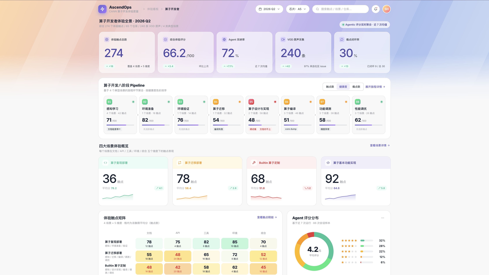

# Dashboard UI Skill

一个 Claude Code skill — 让 Claude 基于 **Asana 配色** + **AscendOps 风格** 一键生成同款单页数据看板 HTML，或把现有页面刷新成同款。



> ⚡ 上图：Variant B（暖色斜向渐变）实际效果 · [Variant A 紫青卡片版本](./examples/ascendops-experience.html) · [Variant B 在线 HTML](./examples/ascendops-experience-warm.html)

---

## 它能做什么（默认场景：计算开发领域）

> 这个 skill 的蓝本就是 **CANN 算子开发体验看板（AscendOps）**，所以最顺手的用法是做"计算开发体验度量"类的页面：算子开发、图开发、推理性能、模型零 Day 发布、Agentic 评测……都是天然适配的业务对象。

输入 | 输出
---|---
"用 dashboard-gen 生成一个算子开发体验看板" | AscendOps 同款：Hero KPI + 8 阶段 Pipeline + 4 场景卡 + 触点矩阵 + Agent 评分 + 痛点 Top10 + VOD 原声 |
"用 dashboard-gen 做一个图开发体验度量页" | 同款风格，但业务对象换成 自定义算子入图 / 融合 Pass / Sample 覆盖度 |
"用 dashboard-gen 把 ascendops-experience.html 刷新一下" | 替换 :root token、批量迁移硬编码 hex、清理反模式 |
"用 dashboard-gen 但 banner 用 Variant B" | 切到暖色斜向渐变（参考 The Software House） |

> 也能做非算子领域的看板（销售/运营/治理/团队周报），SKILL.md 的色族绑定和楼层模板是通用的——只是默认 example 数据全是计算开发的。

---

## 安装

把这个仓库 clone 到 Claude Code 的 skills 目录，命名为 `dashboard-gen`：

```bash
cd ~/.claude/skills
git clone https://github.com/yinyucheng0601/dashboard_UI_skill.git dashboard-gen
```

或者只想用一次、不想常驻：clone 到任意位置，把 `SKILL.md` 路径直接发给 Claude。

> Claude Code 启动后，skill 会自动被发现。可以在终端里输入 `/` 查看可用 skill 列表里有没有 `dashboard-gen`。

---

## 快速上手（5 分钟跑通 AscendOps 同款）

### Step 1 · 准备数据（可选）
如果你有真实的算子开发体验数据（JSON / CSV / JSONL），把路径准备好。比如：
- `cann-agentic-summary.json` — 仓库级 Agent 评分汇总（observable_average / category / Top-Bottom）
- `touchpoints.jsonl` — 体验触点逐条记录（场景 × 维度 × 评分）
- `vod-quotes.md` — VOD 原声（用户研究引语）

**没有真实数据也可以**——直接让 Claude 编合理的示意数据。

### Step 2 · 在 Claude Code 里触发

```
/dashboard-gen
做一个算子开发体验看板，数据在 ~/my-data/，
要展示算子开发八阶段、4 个典型场景（复现部署/迁移部署/Builtin定制/基本功能实现）、
Agent 采纳率、痛点 Top10、VOD 原声。banner 用 Variant A。
```

或自然语言触发（命中 SKILL.md 的"触发条件"关键词）：

```
请基于 ~/cann-dashboard/ 的数据生成一个 CANN 算子开发体验度量 dashboard
```

### Step 3 · Claude 会先给方案让你确认
基于 dashboard-ui-design.md 的组件清单，挑 8–12 个楼层，给出 ASCII 布局图 + 业务映射，你改 / 确认后才会写代码（不会偷跑）。

### Step 4 · 生成 HTML + 浏览器验证
单文件 HTML 写完后会 `open` 浏览器让你看效果。后续微调直接说"把折线颜色换成 Coral"、"Hero KPI 高度再加 20px"，Claude 会按 Asana token 改。

---

## 计算开发领域常见看板配方

| 看板类型 | 推荐楼层组合 | 4 业务对象建议 |
|---|---|---|
| **算子开发体验**（AscendOps 同款） | Hero / 8 阶段 Pipeline / 4 场景 / 触点矩阵 / Agent 评分 / 痛点 Top10 / 仓库 Top-Bottom / 趋势 / VOD | 复现部署 / 迁移部署 / Builtin 定制 / 基本功能实现 |
| **图开发体验度量** | Hero / 5 阶段 Pipeline / 3 场景 / 接口满足度 / Sample 覆盖度 / 优秀实践 | 图构造 / 图开发 / 图扩展 / 融合 Pass |
| **模型零 Day 发布** | Hero / 模型时间轴 / 基础模型卡 / SOTA 性能 / E2E 部署 / 性能值趋势 | 基础模型 / SOTA / E2E / 数据集 |
| **PyTorch API 支持度** | Hero / Core test 通过率 / 增强能力 / API 类别条形 / 高频 issue Top | 算子 API / 通信 API / 框架 API / 工具 API |
| **Agentic 体验评测** | Hero / 双场景对比 / 4 指标雷达 / 任务耗时分布 / Token 消耗趋势 | 算子开发 / 模型加速 / 调优 / 推理 |

---

## 包含什么

```
dashboard_UI_skill/
├── SKILL.md                          # Skill 主文件（Claude 读这个）
├── dashboard-ui-design.md            # 完整设计规范（tokens / 组件 / 反模式）
├── examples/
│   ├── ascendops-experience.html     # Variant A: 紫青卡片 Hero
│   └── ascendops-experience-warm.html# Variant B: 暖色整页斜向渐变
└── README.md
```

| 文件 | 干什么 |
|---|---|
| `SKILL.md` | Agent 指令：触发条件、工作流程、色彩迁移 sed 表、硬规则、楼层模板、自检清单 |
| `dashboard-ui-design.md` | 设计系统 v1：完整 `:root` token、字体阶梯、Spacing/Radius/Grid、15+ 组件 spec、可视化规范、反模式 |
| `examples/*.html` | 两套真实蓝本，可直接复制改业务内容 |

---

## 两种 Banner 风格（开箱可选）

### Variant A · 卡片式 Hero（默认）
紫青渐变独立卡 + 装饰圆 + 大字号标题。适合**严肃数据看板**、内容紧凑、需要明确分区。
预览：[examples/ascendops-experience.html](./examples/ascendops-experience.html)

### Variant B · 整页斜向渐变（暖色，参考 The Software House）
暖橙→紫→蓝 6 段斜向渐变 + 平行四边形条带 overlay，Hero 去外壳。适合**偏品牌/营销感**看板、希望页面有"氛围"。


切换方式：生成时跟 Claude 说 "用 Variant A" 或 "用 Variant B"。SKILL.md 里有完整 CSS。

---

## 设计原则（硬规则）

- **单文件 HTML**，无外部 JS 库（chart.js / d3 / echarts 都不要）
- **只用 Asana token**（5 色族 × 5 层 + 10 灰阶 + Navy），禁用 Tailwind 默认色
- **卡片不加重阴影**，靠 1px border + bg 分隔
- **不做浏览器 chrome 装饰**（traffic light、URL bar）
- **业务大数字 48–54px / weight 500**（不要 800/900）
- **业务对象色族 ≤ 4 个**
- **字体** Inter + JetBrains Mono（数字 mono）
- **顶栏全宽**，无侧边导航（除非模块 > 6 个）

完整规范见 [`dashboard-ui-design.md`](./dashboard-ui-design.md)。

---

## 业务对象 ↔ 色族 绑定模板

| s | 色族 | bg (Light) | fg (Dark) | 典型语义 |
|---|------|-----------|-----------|---------|
| 1 | Green  | `#EBFCF7` | `#37C597` | 健康 / 已完成 / 成功类对象 |
| 2 | Gold   | `#FFF8E5` | `#FD9A00` | 中性 / 进行中 / 业务流类对象 |
| 3 | Coral  | `#FEEFF0` | `#E63838` | 警示 / 高优先级 / 风险类对象 |
| 4 | Purple | `#F0EFFA` | `#4F4DA7` | 创新 / 探索类 / 品牌核心对象 |

---

## 我没用 Claude Code，能用吗？

可以。`SKILL.md` 本身是个详细的 prompt + 实现指南，把它丢给任何 LLM（Claude API / ChatGPT / Cursor / Cline）+ `dashboard-ui-design.md` 都能生成同款看板。两个 example HTML 也可以直接打开当 starter template。

---

## License

MIT
